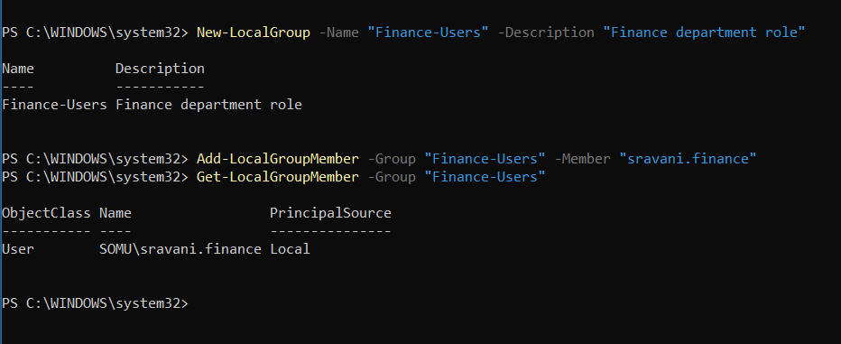
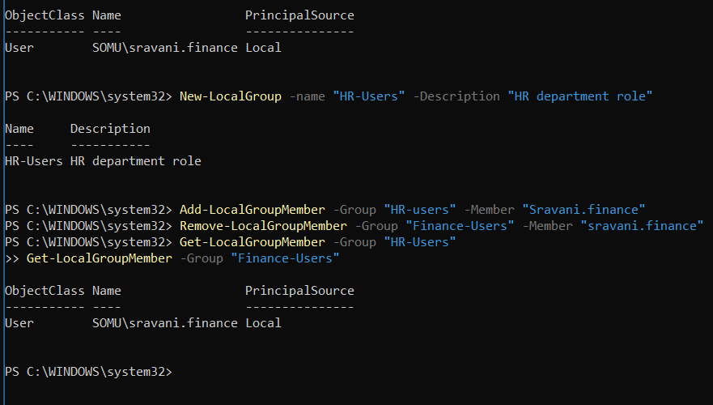
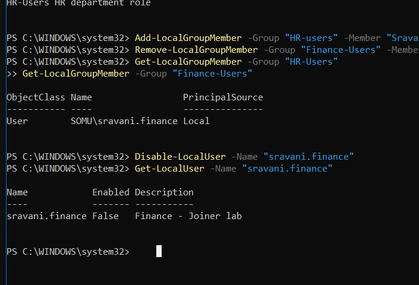
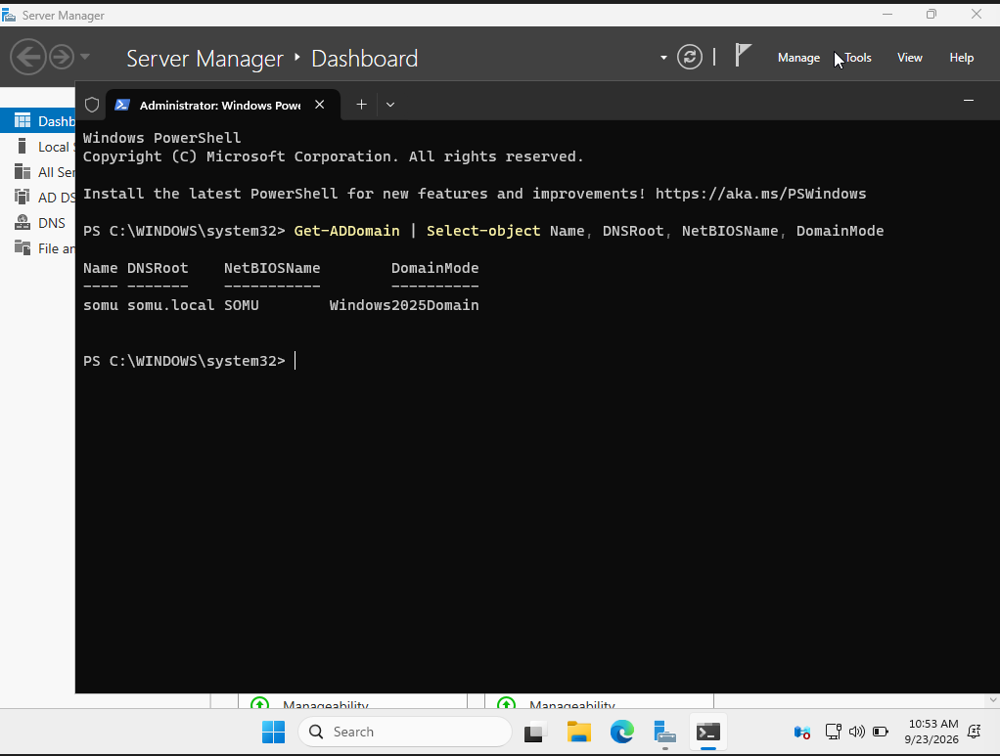
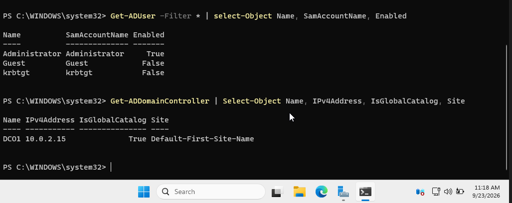
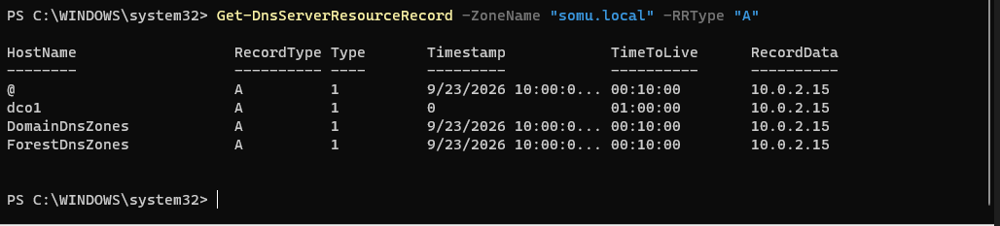
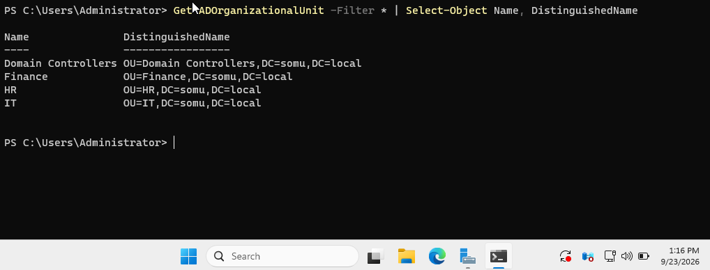
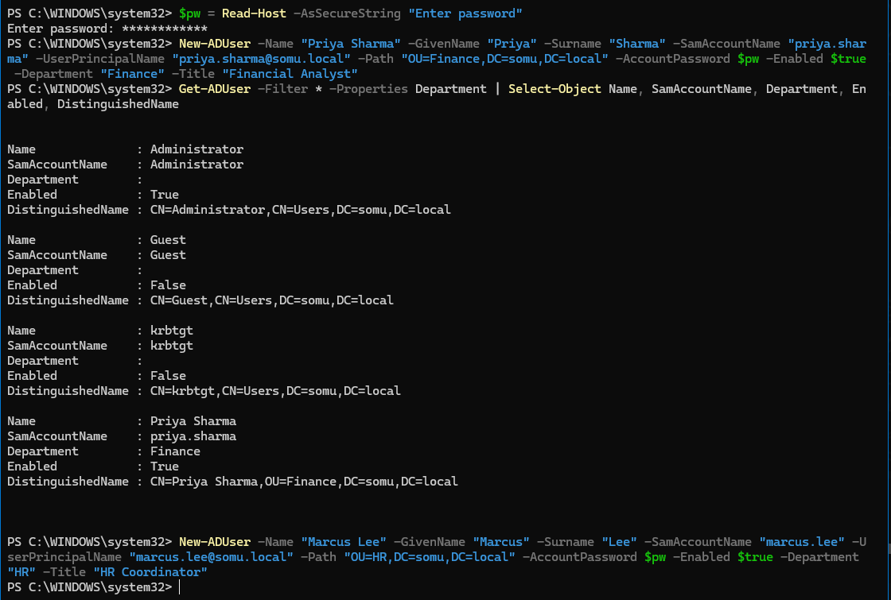
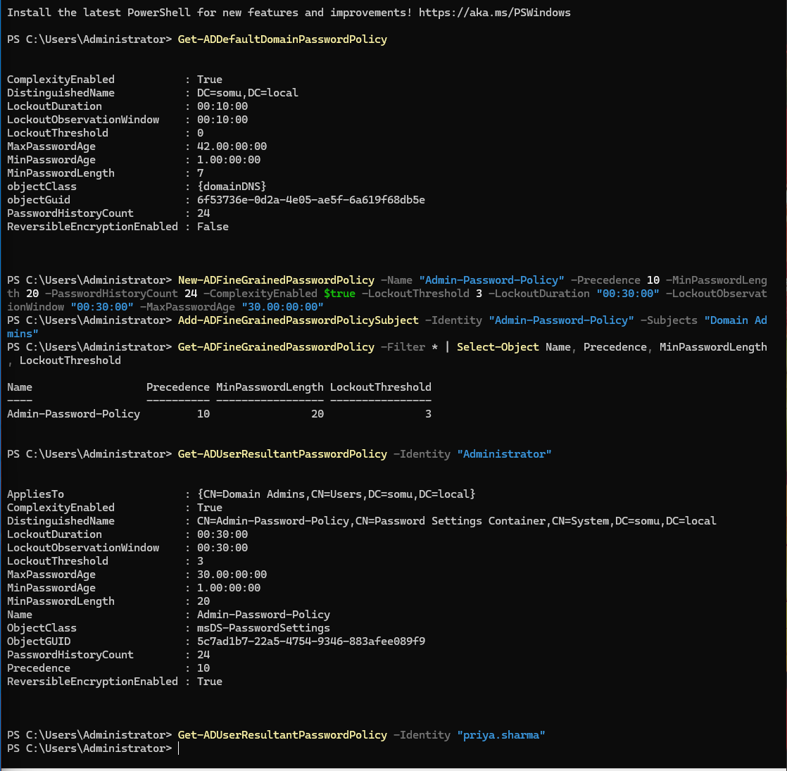
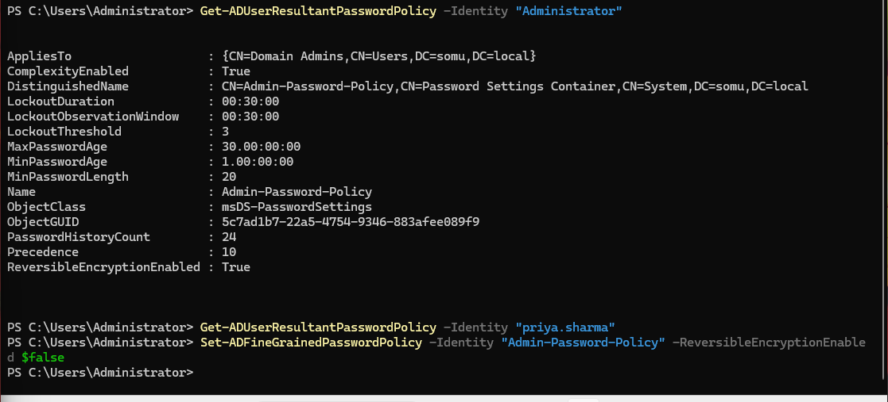

# Active Directory Identity Lab

A Windows Server 2025 domain built from scratch to practice identity and access
management: user lifecycle, role-based access control, delegated administration,
Group Policy, password policy, service account hardening, and audit logging.

Everything below was built and verified by hand in PowerShell, then cross-checked
in the GUI consoles. Commands, errors, and findings are documented as they happened.

**Cloud identity:** see [`entra/`](entra/) for the Microsoft Entra ID half of this lab — identity investigation from sign-in logs, Conditional Access policy design, and an automated privileged access review in Graph PowerShell.


---

## Environment

| Component | Detail |
|---|---|
| Hypervisor | Oracle VirtualBox 7.2 |
| Guest OS | Windows Server 2025 Standard (Desktop Experience) |
| Domain | `somu.local` |
| Domain Controller | DC01 — 10.0.2.15 (static) |
| Roles | AD DS, DNS |
| Host | Windows 11, 16 GB RAM |

```
                    ┌─────────────────────────────┐
                    │   DC01  •  10.0.2.15        │
                    │   Windows Server 2025       │
                    │   AD DS + DNS               │
                    └──────────────┬──────────────┘
                                   │
                          somu.local (forest root)
                                   │
        ┌──────────────┬───────────┴───────┬──────────────┐
        │              │                   │              │
   OU=Finance      OU=HR               OU=IT      OU=Domain Controllers
   Priya Sharma   Marcus Lee          Sam Desk          DC01
   Finance-Staff  HR-Staff            Helpdesk
                                      svc-sql
                                      gmsa-backup
```

---

## 1. Joiner / Mover / Leaver

The lifecycle that defines the IAM role. Practised first with local accounts to
isolate the concept before moving to the domain.

**Joiner** — create the account, then grant access through a *group*, never
directly to the user. The group is the role; membership is the grant.

```powershell
New-LocalGroup -Name "Finance-Users" -Description "Finance department role"
Add-LocalGroupMember -Group "Finance-Users" -Member "sravani.finance"
Get-LocalGroupMember -Group "Finance-Users"
```



**Mover** — the step organisations skip. Adding the new department's access is
obvious; *removing* the old one is what prevents **privilege creep**, where
access accumulates across every role a person has ever held.

```powershell
Add-LocalGroupMember -Group "HR-Users" -Member "sravani.finance"
Remove-LocalGroupMember -Group "Finance-Users" -Member "sravani.finance"
```



The empty result from `Finance-Users` is the evidence an auditor wants: new access
granted, old access revoked, nothing left behind.

**Leaver** — disable rather than delete. The account stops working immediately but
survives for audit and investigation; deletion comes after a retention period.

```powershell
Disable-LocalUser -Name "sravani.finance"
Get-LocalUser -Name "sravani.finance"
```



Note that disabling does **not** strip group memberships. If the account were
re-enabled by mistake, it would return with full access — so a complete leaver
process removes groups as well.

---

## 2. Domain controller promotion

Renamed the server to `DC01`, assigned a **static IP**, and pointed its DNS at
`127.0.0.1` before promoting — a DC runs DNS, so it must resolve its own records.
A DHCP-assigned address would break every SRV record clients use to find the domain.

```powershell
Get-ADDomain | Select-Object Name, DNSRoot, NetBIOSName, DomainMode
```



```powershell
Get-ADUser -Filter * | Select-Object Name, SamAccountName, Enabled
Get-ADDomainController | Select-Object Name, IPv4Address, IsGlobalCatalog, Site
```



The built-in accounts are worth noting: `Administrator` enabled, `Guest` disabled,
and `krbtgt` disabled. `krbtgt` never logs in, but its password hash signs every
Kerberos ticket in the domain — an attacker who steals it can forge a **Golden
Ticket** and impersonate anyone.

Verified the DNS records AD created during promotion:

```powershell
Get-DnsServerResourceRecord -ZoneName "somu.local" -RRType "A"
```



All four point at the static IP set before promotion. This is the link between AD
and DNS: a client resolves `somu.local`, gets 10.0.2.15, and finds the DC.
*Most Active Directory problems are actually DNS problems.*

---

## 3. OU structure and RBAC

```powershell
New-ADOrganizationalUnit -Name "Finance" -Path "DC=somu,DC=local"
Get-ADOrganizationalUnit -Filter * | Select-Object Name, DistinguishedName
```



Distinguished Names read right to left, like a reversed file path:
`OU=Finance,DC=somu,DC=local`. The `Domain Controllers` OU is created
automatically during promotion, since DCs get their own Group Policy.

Users provisioned with full metadata — UPN, department, title — because those
attributes later drive dynamic group membership and access reviews.

```powershell
New-ADUser -Name "Priya Sharma" -GivenName "Priya" -Surname "Sharma" `
  -SamAccountName "priya.sharma" -UserPrincipalName "priya.sharma@somu.local" `
  -Path "OU=Finance,DC=somu,DC=local" -AccountPassword $pw -Enabled $true `
  -Department "Finance" -Title "Financial Analyst"
```



Compare the Distinguished Names: the built-ins sit in `CN=Users`, a *container*
rather than an OU — no GPO can be linked to it. That is why production
environments move accounts into real OUs.

```powershell
New-ADGroup -Name "Finance-Staff" -GroupScope Global -GroupCategory Security `
  -Path "OU=Finance,DC=somu,DC=local"
Add-ADGroupMember -Identity "Finance-Staff" -Members "priya.sharma"
```

Structured per **AGDLP** — Accounts into Global groups, Global groups into Domain
Local groups, permissions on the Domain Local group.

**OUs are for management** (Group Policy links and delegation). **Groups are for
access.** A user lives in exactly one OU but can belong to many groups.

---

## 4. Group Policy and precedence

Built `Finance-Screen-Lock` linked to the Finance OU, combining three settings that
only work together:

| Setting | Value | Purpose |
|---|---|---|
| Enable screen saver | Enabled | turns the mechanism on |
| Screen saver timeout | 300 sec | fires after 5 min idle |
| Password protect the screen saver | Enabled | requires re-auth |

Any one alone does nothing. The GPO help text spells out the dependency, and
missing it is a common cause of "my policy isn't applying" tickets.

Then tested precedence deliberately by creating a conflicting baseline GPO:

```powershell
Get-GPInheritance -Target "OU=Finance,DC=somu,DC=local"
```

**Precedence, in order of strength:**

1. **Enforced** GPOs — nothing overrides these
2. **Closest container** — OU beats domain beats site (LSDOU)
3. **Link order** — lower number wins at the same level
4. **Block Inheritance** stops 2 and 3 from above, but never 1

Confirmed by flipping link order and watching the winning value change, then
marking the baseline **Enforced** and watching it jump to the top of
`InheritedGpoLinks` despite a worse link order.

---

## 5. Nested groups

```powershell
New-ADGroup -Name "All-Employees" -GroupScope Global -GroupCategory Security -Path "DC=somu,DC=local"
Add-ADGroupMember -Identity "All-Employees" -Members "Finance-Staff","HR-Staff"

Get-ADGroupMember -Identity "All-Employees"              # returns the 2 GROUPS
Get-ADGroupMember -Identity "All-Employees" -Recursive   # returns the actual USERS
```

`-Recursive` walks down through nested groups and returns the leaf users. That is
the command that answers the real access-review question — *"who actually has this
access?"* — rather than just listing direct members.

Nested groups are also where privilege creep hides: someone joins a harmless group
that is nested two levels up inside one with elevated rights.

---

## 6. Delegated administration

Rather than granting Domain Admin to service desk staff, delegated a single right
scoped to a single OU:

> The `Helpdesk` group can reset passwords for users in the **HR OU only**.

Verified the ACEs written onto the OU object:

```powershell
(Get-Acl "AD:OU=HR,DC=somu,DC=local").Access |
  Where-Object {$_.IdentityReference -like "*Helpdesk*"} |
  Select-Object IdentityReference, ActiveDirectoryRights, ObjectType
```

| Right | GUID | Meaning |
|---|---|---|
| ReadProperty, WriteProperty | `bf967a0a-…` | pwdLastSet — force change at next logon |
| ExtendedRight | `00299570-246d-11d0-a768-00aa006e0529` | **Reset Password** |

Those GUIDs are identical in every AD deployment. Confirmed the boundary held by
running the same query against the Finance OU — empty result, no rights.

**Reset vs Change** matters: *change* requires knowing the old password, *reset*
does not. Anyone who can reset a password can take over that account, so delegating
Reset Password over an OU containing privileged accounts creates an escalation path.

---

## 7. Fine-grained password policy

Password policy in AD is **domain-wide** — one per domain, set in the Default Domain
Policy. Linking a password GPO to an OU silently does nothing for domain accounts.
The correct mechanism is a **PSO (Password Settings Object)**, which targets a group
or user instead.

```powershell
Get-ADDefaultDomainPasswordPolicy

New-ADFineGrainedPasswordPolicy -Name "Admin-Password-Policy" -Precedence 10 `
  -MinPasswordLength 20 -PasswordHistoryCount 24 -ComplexityEnabled $true `
  -LockoutThreshold 3 -LockoutDuration "00:30:00" `
  -LockoutObservationWindow "00:30:00" -MaxPasswordAge "30.00:00:00"

Add-ADFineGrainedPasswordPolicySubject -Identity "Admin-Password-Policy" -Subjects "Domain Admins"
Get-ADUserResultantPasswordPolicy -Identity "Administrator"
```



One frame showing both the problem and the fix. The **default domain policy**
permits 7-character passwords and has `LockoutThreshold: 0` — lockout disabled
entirely, meaning unlimited password guesses against every account in the domain.
The **PSO** raises Domain Admins to 20 characters with lockout after 3 attempts.

Checking a non-admin (`priya.sharma`) returns **nothing** — correct behaviour
meaning no PSO applies and the account falls back to the domain default, not an error.

---

## 8. Service accounts and gMSA

Built both kinds side by side to compare the risk profile.

**Traditional service account** — the Kerberoastable pattern:

```powershell
New-ADUser -Name "svc-sql" -SamAccountName "svc-sql" `
  -UserPrincipalName "svc-sql@somu.local" -Path "OU=IT,DC=somu,DC=local" `
  -AccountPassword $pw -Enabled $true -PasswordNeverExpires $true `
  -Description "SQL Server service account - owner: IT DBA team"

setspn -S MSSQLSvc/sql01.somu.local:1433 svc-sql
```

**Group Managed Service Account** — AD generates and rotates a 240-character password:

```powershell
Add-KdsRootKey -EffectiveTime ((Get-Date).AddHours(-10))
New-ADServiceAccount -Name "gmsa-backup" -DNSHostName "gmsa-backup.somu.local" `
  -PrincipalsAllowedToRetrieveManagedPassword "Domain Controllers"
```

| | Traditional | gMSA |
|---|---|---|
| Password | human-set, never rotates | 240 chars, auto-rotated |
| Anyone knows it | yes | no |
| Interactive logon | possible | blocked |
| Kerberoastable | yes | not usefully |

`ObjectClass` differs — `msDS-GroupManagedServiceAccount` vs `user` — which is why
`Get-ADUser` won't find a gMSA.

The `Description` field naming an owner is deliberate. Service accounts with no
recorded owner are a standard audit finding.

---

## 9. Audit logging

Enabled the audit subcategories that matter, generated events, and read them back.

```powershell
auditpol /set /subcategory:"User Account Management" /success:enable /failure:enable
auditpol /set /subcategory:"Security Group Management" /success:enable /failure:enable
auditpol /set /subcategory:"Logon" /success:enable /failure:enable
auditpol /set /subcategory:"Kerberos Service Ticket Operations" /success:enable /failure:enable

Get-WinEvent -FilterHashtable @{LogName='Security'; ID=4720} -MaxEvents 1 |
  Format-List TimeCreated, Message
```

**Event IDs tracked:** 4624/4625 (logon success/failure), 4720 (account created),
4722/4725 (enabled/disabled), 4728 (added to group), 4740 (lockout),
4769 (service ticket — where Kerberoasting appears), 5136 (object modified).

Every account-management event carries a **Subject** (who did it) and a **target**
(who it was done to). The Subject's `Logon ID` is the pivot: searching 4624 events
for the same ID identifies the source machine and logon type, turning
*"Administrator did it"* into *"this session, from this host, at this time."*

**RIDs are universal** — the last chunk of a SID identifies the object in every
Windows domain: 500 Administrator, 501 Guest, 502 krbtgt, 512 Domain Admins,
1000+ created accounts. Renaming the built-in Administrator is cosmetic, since
enumeration is by RID.

---

## Security findings

Working through the build surfaced several weak defaults worth recording.

| Finding | Detail | Risk |
|---|---|---|
| **Lockout disabled by default** | `LockoutThreshold: 0` in Default Domain Policy | Unlimited password guessing against every account |
| **Weak minimum length** | `MinPasswordLength: 7` | Below current guidance |
| **Forced 42-day rotation** | `MaxPasswordAge: 42.00:00:00` | NIST now advises against scheduled rotation without cause |
| **PSO defaulted to reversible encryption** | `ReversibleEncryptionEnabled: True` on a property never set | Stores passwords recoverably — effectively plaintext |
| **Kerberoastable service account** | SPN + `PasswordNeverExpires` | Any domain user can request the ticket and crack it offline |
| **Security log is circular, 128 MB** | ~11,400 events from a week of light use | On a production DC, evidence can be overwritten within hours |

The reversible-encryption finding is the most instructive: it was a default never
chosen, on a policy object created moments earlier.



```powershell
Set-ADFineGrainedPasswordPolicy -Identity "Admin-Password-Policy" -ReversibleEncryptionEnabled $false
```

Reading back *every* property after creating a policy object — not just the ones
you set — is the habit that caught it.

### Audit queries worth reusing

```powershell
# AS-REP roastable — Kerberos pre-auth disabled
Get-ADUser -Filter {DoesNotRequirePreAuth -eq $true} -Properties DoesNotRequirePreAuth |
  Select-Object Name

# Blank password permitted, enabled accounts only
Get-ADUser -Filter {PasswordNotRequired -eq $true -and Enabled -eq $true} `
  -Properties PasswordNotRequired | Select-Object Name

# Kerberoastable — has an SPN. Runs fine as an unprivileged user.
Get-ADUser -Filter {ServicePrincipalName -like "*"} `
  -Properties ServicePrincipalName, PasswordLastSet |
  Select-Object Name, ServicePrincipalName, PasswordLastSet
```

Empty output is the good result. On the SPN query, check `PasswordLastSet` — a
service account whose password is years old is an urgent finding.

---

## Problems hit and how they were resolved

**Host blue screen during VM operation** — `KERNEL_DATA_INPAGE_ERROR (0x7A)`.
VirtualBox's Acceleration tab was greyed out, indicating something else held
hardware virtualization. Disk health checked clean (`Get-PhysicalDisk` →
Healthy/OK), ruling out failing hardware. Root cause was Hyper-V claiming the
hypervisor. Resolved with `bcdedit /set hypervisorlaunchtype off` plus a reboot —
the setting only takes effect at boot, which cost an extra cycle to work out.

**Password complexity rejection on user creation** — `New-ADUser` failed with
*"The password does not meet the length, complexity, or history requirement."*
The `$pw` variable had been cleared by a reboot, so an empty SecureString was being
passed. PowerShell variables do not survive restarts.

**`-Group` vs `-Identity`** — `Add-LocalGroupMember` uses `-Group`;
`Add-ADGroupMember` uses `-Identity`. The error (`ParameterBindingException`, *"A
parameter cannot be found that matches parameter name 'Group'"*) named the problem
precisely.

**Silent property failures** — a misspelled *cmdlet* throws
`CommandNotFoundException`. A misspelled *property* in `Select-Object` throws
nothing and returns an empty column. Same with `$` inside a property name
(`IPv$Address`), which PowerShell reads as a variable. Empty columns, not errors,
are the signal.

**Performance filtering** — `-FilterHashtable` filters at the log engine;
`Where-Object` pulls every event into memory first. The difference is negligible in
a lab and severe on a production DC.

---

## Repository contents

```
ad-identity-lab/
├── README.md
├── screenshots/
├── ad-snippets.md              # command reference built during the lab
└── day09-ad-auditing-notes.md  # event IDs, SIDs, UAC flags, retention
```

---

## Next

- Entra ID hybrid identity and directory sync
- SSO and Conditional Access
- PowerShell automation of the joiner/mover/leaver process
- Access review and certification workflow
